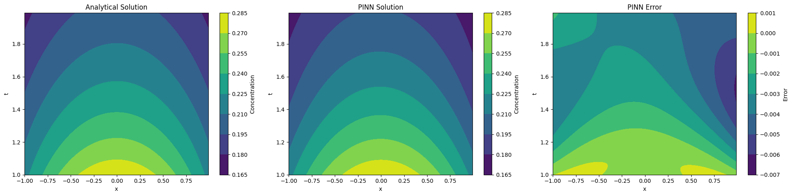
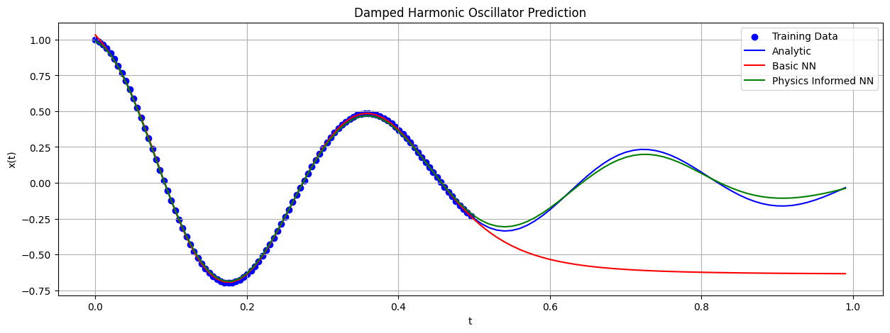

# Physics-Informed Neural Networks (PINNs)
---
* This is a basic **PyTorch** implementation of Physics-Informed Neural Networks (PINNs).
* PINNs restric the learned function space to physical solutions fulfilling priorly given PDEs or ODEs (for more details see citation below).
* I implemented the time evolution of an initial Gaussian profile governed by the **1D Diffusion Equation**, as well as the time evolution of a **Damped Harmonic Oscillator** given some initial oscillations.
* Both solutions with all steps are self-contained in the independant Jupyter notebooks `solve_DiffusionEquation.ipynb` and `solve_DampedHarmonicOscillator.ipynb`.

## Diffusion Equation Results
Comparison of analytic solution (left) with PINN results (center) with deviations (right).

## Damped Harmonic Oscillator Results
Comparison of analytic solution with the generalization capabilities of a basic NN and of a PINN.

## Citation
Project based on:
* **Paper**: Raissi, Maziar, Paris Perdikaris, and George E. Karniadakis. "Physics-informed neural networks: A deep learning framework for solving forward and inverse problems involving nonlinear partial differential equations." Journal of Computational Physics 378 (2019): 686-707.
* **Github Repo**: https://github.com/maziarraissi/PINNs
